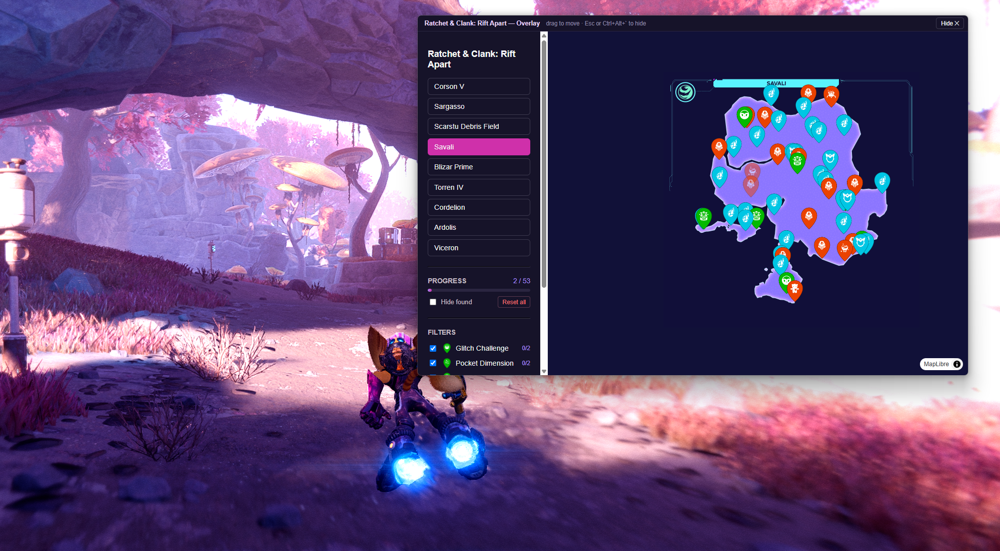
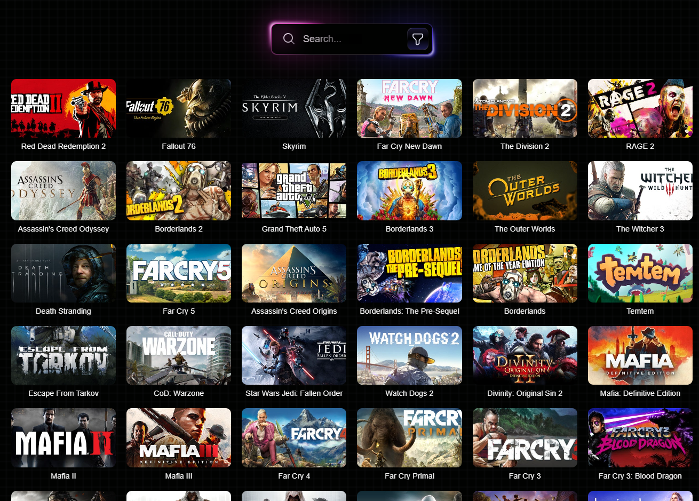
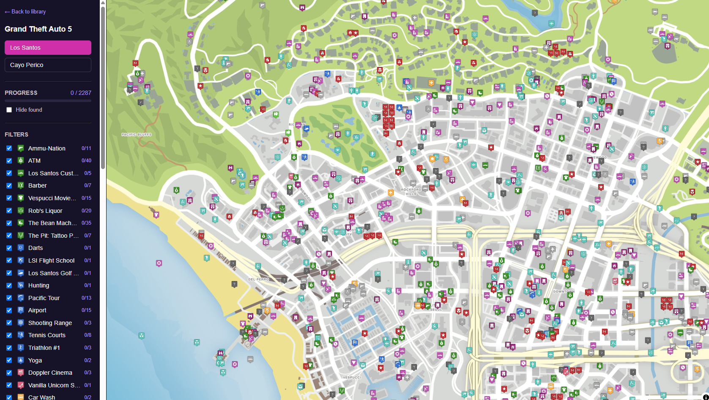
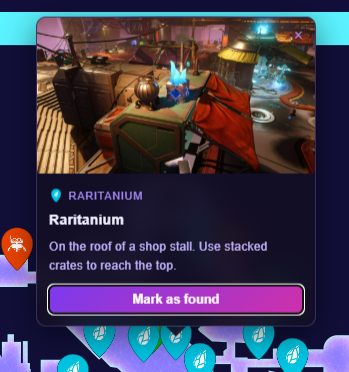
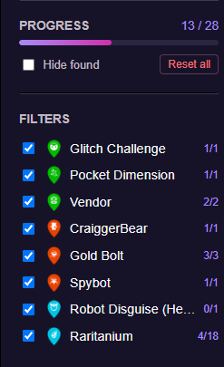

<p align="center">
  
</p>

<h1 align="center">CTA — CollectThemAll</h1>

<p align="center">
  A blazing-fast, native desktop overlay for tracking game collectibles on interactive maps.
</p>

<p align="center">
  
  
  
  
  
</p>

> 📱 **iOS support is in active development** — the UI and state logic share a codebase that compiles to iOS via Tauri v2. See the [iOS section](#ios) below.

## What it does

CollectThemAll (CTA) is a cross-platform companion app for completionists. It pulls
interactive game maps and collectible locations, renders them in a smooth, hardware-accelerated
map view, and lets you check off every chest, shrine, and secret as you find it — **without
alt-tabbing out of your game**.

A global hotkey summons a transparent, always-on-top overlay that floats over the running game
and mirrors whatever map you last opened, so your progress stays in sync wherever you mark it.

## Why it's useful

Most game trackers are Electron apps that ship a full Chromium instance, eating hundreds of
megabytes of RAM and stealing CPU cycles (and frames) from the game you're actually trying to
play. CTA is built on **Tauri v2 + Svelte 5**, compiling to a lightweight native binary that
renders thousands of map markers without dropping system frames.

- **🪶 Featherweight** — a native binary instead of a bundled browser; minimal RAM/CPU footprint while gaming.
- **🎮 In-game overlay** — `Ctrl + Alt + \`` toggles a borderless, always-on-top window that mirrors your active map.
- **⚡ Instant maps, streamed tiles** — a Rust caching proxy serves map tiles from disk and streams higher-res tiles from the CDN on demand, so maps open immediately.
- **📴 Offline first** — game assets, marker data, and your found-location progress are all saved locally.
- **🔍 Filter & track** — toggle marker categories, hide found items, and watch per-category completion progress update live.
- **🔄 Cross-window sync** — mark a location in the main window or the overlay; both stay consistent.

## Screenshots

### In-game overlay

The floating, always-on-top overlay mirrors your active map so you can track collectibles without leaving the game.

<p align="center">
  
</p>

### Game library

Pick a game to load its maps and collectible data.

<p align="center">
  
</p>

### Interactive map

Thousands of markers rendered smoothly, with category filters and live completion tracking.

<p align="center">
  
</p>

<table align="center">
  <tr>
    <td width="50%"></td>
    <td width="50%"></td>
  </tr>
  <tr>
    <td align="center"><em>Marker details &amp; found toggle</em></td>
    <td align="center"><em>Per-category completion progress</em></td>
  </tr>
</table>

## Tech stack

| Layer        | Technology                                                        |
| ------------ | ----------------------------------------------------------------- |
| Frontend     | [Svelte 5](https://svelte.dev) (runes) + TypeScript               |
| Map engine   | [MapLibre GL JS](https://maplibre.org) (Web Mercator projection)  |
| Backend      | [Tauri v2](https://tauri.app) (Rust)                              |
| Networking   | `reqwest` + `tokio` async tile fetching with a custom `tile://` protocol |
| Build / dev  | Vite 6 + SvelteKit (static adapter)                               |

## Getting started

### Prerequisites

- **Node.js** v18+ and a package manager (npm, pnpm, or yarn)
- **Rust** toolchain (`cargo`, `rustc`) — install via [rustup](https://rustup.rs)
- **OS build dependencies:**
  - **Windows:** Microsoft C++ Build Tools (MSVC) + WebView2
  - **Linux:** `webkit2gtk` and related packages ([see Tauri prerequisites](https://tauri.app/start/prerequisites/))
  - **macOS:** Xcode Command Line Tools

### Run in development

```bash
# 1. Clone
git clone https://github.com/yourusername/CollectThemAll.git
cd CollectThemAll

# 2. Install frontend dependencies
npm install

# 3. Launch the app with hot reload (frontend + Rust backend)
npm run tauri dev
```

### Usage

1. Launch CTA — the **game library** loads available games.
2. Click a game to download its lightweight assets (markers + location data). Map tiles stream in on demand.
3. Browse the map, toggle marker categories, and click a marker to mark it as **found**.
4. While in a game, press **`Ctrl + Alt + \``** to toggle the floating overlay and keep tracking without leaving the game (press **Esc** to dismiss it).

### Build for production

```bash
npm run tauri build
```

Optimized installers/executables are written to `src-tauri/target/release/bundle/`.

## iOS

The iOS port shares the same Svelte 5 frontend and Rust backend as the desktop build. Tiles stream on demand via the `tile://` protocol handled by WKWebView — no bulk pre-download is needed or triggered automatically.

### Requirements

- **macOS** (Xcode runs only on Apple hardware)
- **Xcode** 16+ with iOS SDK installed
- **CocoaPods** — `brew install cocoapods`
- **Rust iOS targets:**

  ```bash
  rustup target add aarch64-apple-ios aarch64-apple-ios-sim x86_64-apple-ios
  ```

### Run on Simulator

```bash
npm run tauri ios dev
```

### Build for Device

A device build requires an Apple Developer account and provisioning profile. Set your 10-character team ID before building:

```bash
export APPLE_DEVELOPMENT_TEAM=XXXXXXXXXX
npm run tauri ios build
```

### iOS limits

- **Overlay is desktop-only.** The always-on-top overlay window and the `Ctrl+Alt+\`` global hotkey are compiled out on mobile (`#[cfg(desktop)]` in Rust) and redirect to `/` as a defence-in-depth measure on the frontend. This is by design.
- **No bulk tile pre-download on mobile.** The "Download all tiles" commands exist in the Rust backend but are not exposed in the mobile UI. Tiles stream in on demand as you pan and zoom.

## Android

The Android port shares the same Svelte 5 frontend and Rust backend as the desktop and iOS builds. Tiles stream on demand via `http://tile.localhost` (Android WebView cannot `fetch()` a raw custom scheme, so Tauri maps `tile://` to this HTTP alias automatically). A release-signed `.apk` is attached to every GitHub Release.

### Requirements

- **JDK 17+**
- **Android Studio** (includes SDK, build tools, and `sdkmanager`)
- **NDK 26** — install via Android Studio SDK Manager or:

  ```bash
  sdkmanager "ndk;26.3.11579264"
  ```

- **Rust Android targets:**

  ```bash
  rustup target add aarch64-linux-android armv7-linux-androideabi i686-linux-android x86_64-linux-android
  ```

- Set environment variables (add to `~/.zshrc`):

  ```bash
  export ANDROID_HOME="$HOME/Library/Android/sdk"
  export NDK_HOME="$ANDROID_HOME/ndk/26.3.11579264"
  ```

### Run on Emulator or Device

```bash
npm run tauri android dev
```

### Build APK

```bash
npm run tauri android build -- --apk
```

The signed APK is also attached to every GitHub Release automatically by CI.

### Android limits

- **Overlay is desktop-only.** The always-on-top overlay window and the `Ctrl+Alt+\`` global hotkey are compiled out on mobile (`#[cfg(desktop)]` in Rust) and redirect to `/` as a defence-in-depth measure on the frontend. This is by design.
- **No bulk tile pre-download on mobile.** The "Download all tiles" commands exist in the Rust backend but are not exposed in the mobile UI. Tiles stream in on demand as you pan and zoom.

## Project structure

```text
CollectThemAll/
├── src/                          # Svelte 5 frontend
│   ├── components/               # UI components, each kept small and focused
│   │   ├── GameLibrary.svelte    # game grid + download-on-click
│   │   ├── GameMapView.svelte    # the map; orchestrates the sidebar pieces below
│   │   ├── MapSwitcher.svelte    # ├─ map list (presentational)
│   │   ├── ProgressPanel.svelte  # ├─ progress box (presentational)
│   │   ├── CategoryFilters.svelte# └─ filter checkboxes (presentational)
│   │   ├── SearchBar.svelte / Background.svelte
│   ├── lib/
│   │   ├── api/                  # Tauri command bindings, split by topic
│   │   │   ├── games.ts          # games list
│   │   │   ├── assets.ts         # images / location data on disk
│   │   │   ├── tiles.ts          # tile download + metadata
│   │   │   └── mapgenie.ts       # barrel re-export (back-compat)
│   │   ├── map/                  # pure map helpers extracted from GameMapView
│   │   │   ├── markdown.ts       # tiny markdown->HTML (with XSS caution)
│   │   │   ├── geojson.ts        # locations -> GeoJSON
│   │   │   ├── tileUrl.ts        # platform-correct tile:// URL template
│   │   │   └── popup.ts          # marker popup DOM builder
│   │   ├── stores/               # found-marker persistence (localStorage)
│   │   └── types/                # shared TypeScript types (game.ts + barrel)
│   └── routes/                   # SvelteKit routes (library, game/[id], overlay)
└── src-tauri/                    # Rust backend
    ├── src/
    │   ├── lib.rs                # window mgmt, global shortcut, tile:// protocol
    │   └── commands/
    │       └── mapgenie/         # one concern per file:
    │           ├── mod.rs        #   module wiring + the #[tauri::command]s
    │           ├── models.rs     #   data structs
    │           ├── tile_config.rs#   scraped tile config + custom deserializer
    │           ├── http.rs       #   HTTP client + file download
    │           ├── parsing.rs    #   URL/HTML string helpers
    │           ├── cache.rs      #   on-disk + in-memory caches
    │           ├── sprites.rs    #   marker sprite-sheet slicing
    │           └── scraping.rs   #   fetch + extract map page config
    └── tauri.conf.json           # Tauri configuration
```

> ℹ️ **A note on the layout.** Both the frontend and the Rust backend are organised
> as many small, single-purpose files rather than a couple of large ones. This makes
> the code easier to read and to audit — you can find the one place a thing happens
> (e.g. *all* network calls live in `http.rs`/`scraping.rs`, and the only doors the UI
> can open into the backend are the `#[tauri::command]`s in `mapgenie/mod.rs`).

## Roadmap

- [x] iOS build (in active development — see [iOS](#ios))
- [x] Native Android build (in active development — see [Android](#android))
- [ ] User-defined custom markers and notes
- [ ] Cloud sync of found progress across devices

## Getting help

- **Bugs & feature requests:** open an [issue](../../issues).
- **Questions & ideas:** start a [discussion](../../discussions).

## Contributing

Contributions are welcome! Please read [CONTRIBUTING.md](docs/CONTRIBUTING.md) before opening a
pull request. Run `npm run check` to type-check the frontend before submitting.

## License

Released under the [MIT License](LICENSE).
